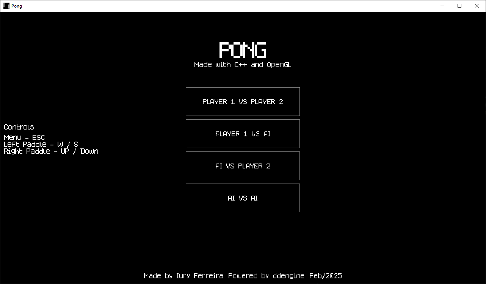
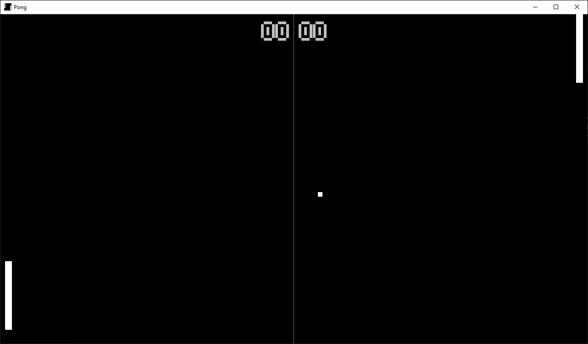

# PONG

## Introduction

This is a simple pong game with 2 players support and a simple AI implementation.  

This game was made to test the 2D game engine that I am developing and it
is based on the v0.0 branch.  

Controls:  
Menu - ESC  
Left Paddle - W/S  
Right Paddle - UP/DOWN  

Engine: [ddengine](https://github.com/criticow/ddengine)  

Menu screenshot  
  
Game screenshot  
  